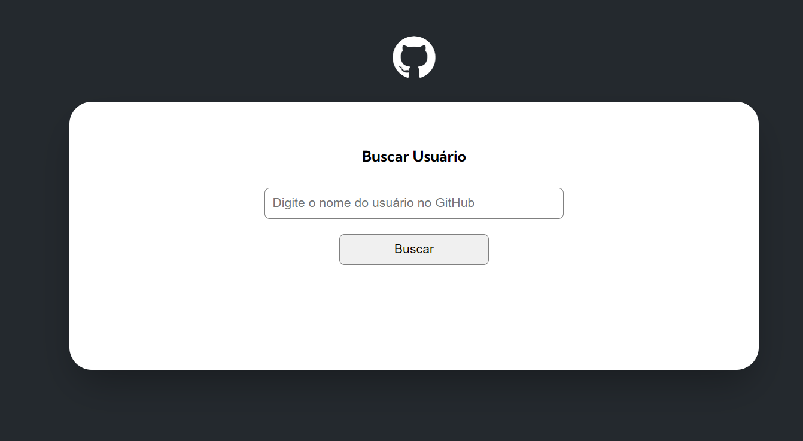
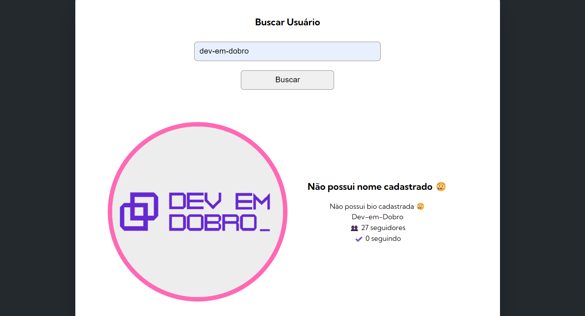
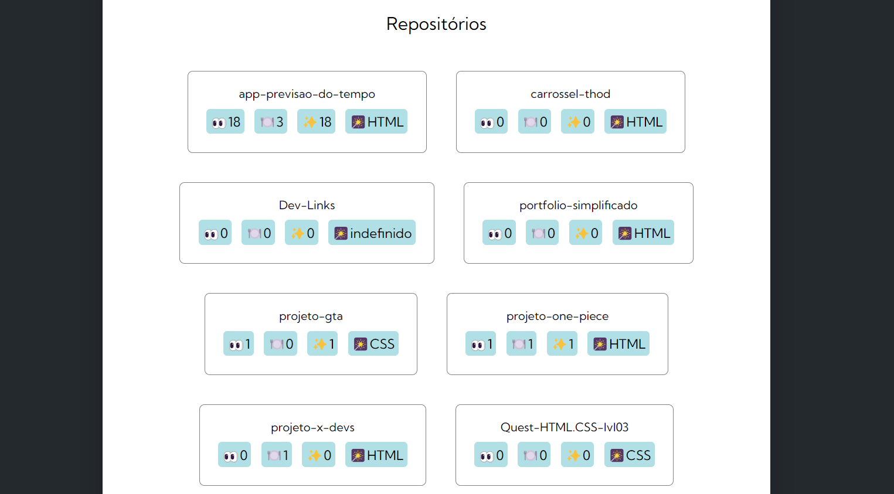
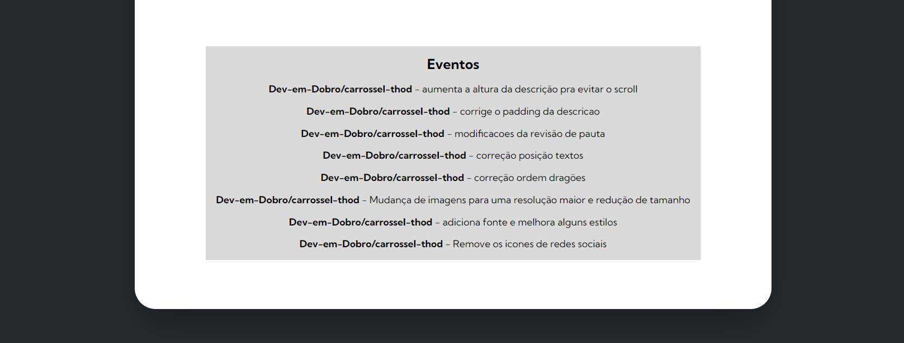

# Quest JavaScript Avançado - Buscando usuários GitHub com fetch 

Este é o projeto da quest de javascript avançado. 

[] 

## O Projeto

O projeto busca dados de usuários através da Api do GitHub utilizando o fetch. São várias solicitações feitas para a Api, como informações do usuário: imagem, nome completo, bio, login, seguidores e quantas pessoas o usuário está seguindo, além de informações relacionadas aos repositórios e eventos.

[] 

[] 

[] 

### Linguagens utilizadas 

- HTML

- CSS

- JavaScript